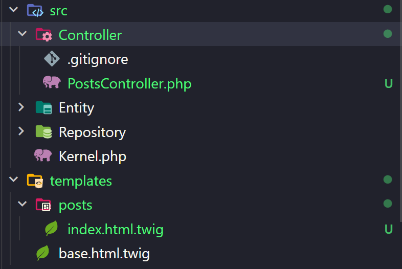

# Lecture 02: Symfony Introduction

## Installation Instructions

Last week, we already installed XAMPP

Now, we will install needed packages for Symfony

- Install Composer, which is used to install PHP packages - https://getcomposer.org/download/
- Install Scoop - https://scoop.sh/
- Install Symfony CLI - https://symfony.com/download

## Visual Studio Code extensions

Follow the video tutorial below for VS Code extensions

- https://www.youtube.com/watch?v=wSw-kDBW_Zw&list=PLFHz2csJcgk-t8ErN1BHUUxTNj45dkSqS&index=4

You will install the following extensions:

- PHP Intelephense
- PHP Namespace Resolver
- Symfony for VScode
- Twig

## Create a new Symfony project

To create, we need to open the Terminal on Windows




Then, enter the comment below to create a new Symfony project

```bash
symfony new --webapp symfony-introduction # Create a new Symfony project
```

## Start the project

To start the project, we need to go to the project folder then start it.

```bash
cd symfony-introduction # Go to the folder
symfony serve # Start the project
```
