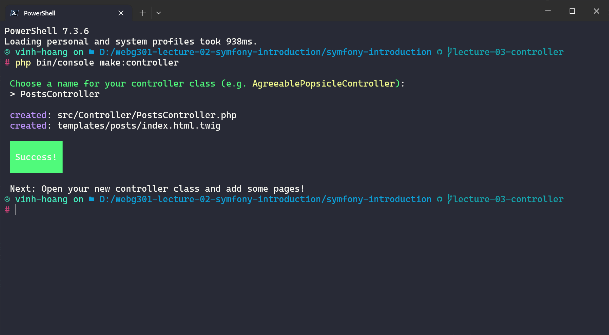
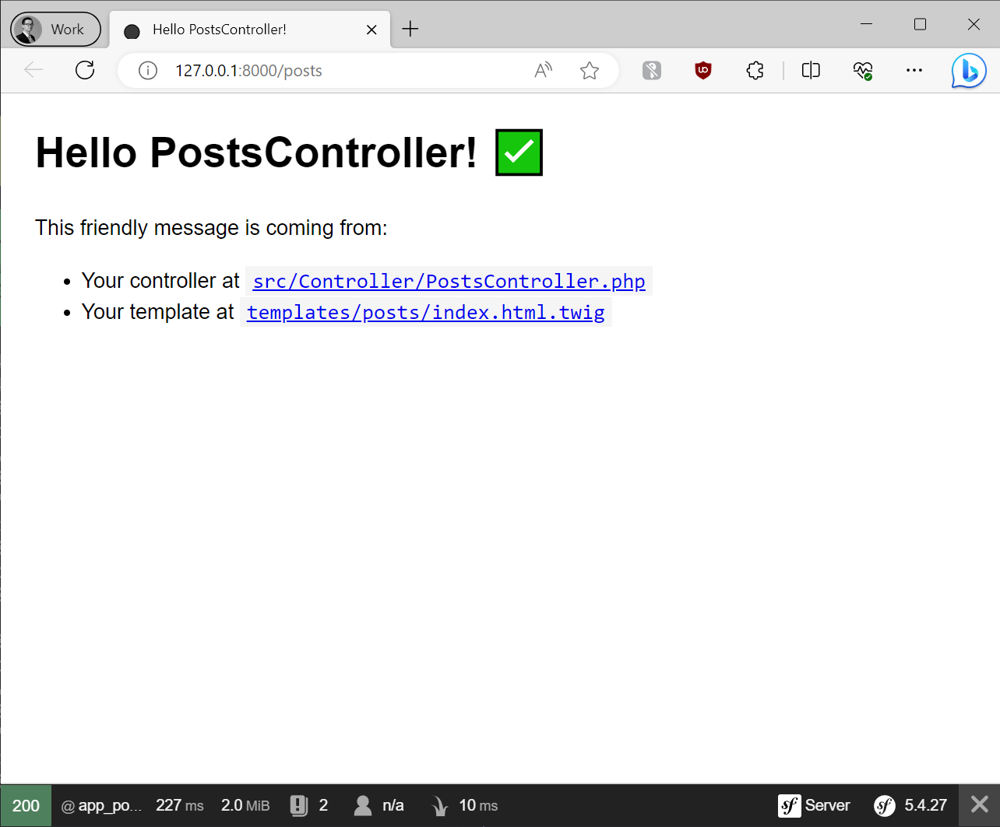
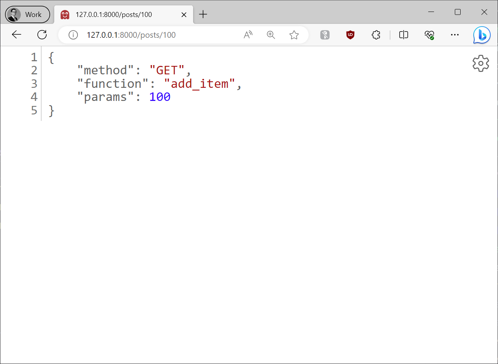

# Lecture 03: Controller

## Create the first controller

Now, we are going to create the first controller with command below

```bash
php bin/console make:controller
```



After that, the controller is created


Now, start the project and navigate to the URL `http://127.0.0.1:8000/posts` to see the result of the controller

```bash
symfony serve
```



## Create the first action

Now, in the `PostsController.php`, we are going to create the action below

```php
/**
     * @Route("/posts/overview", name="app_overview")
     */
    public function overviewAction(): Response
    {
        return $this->json(
            [
                'num_items' => 2,
                'total' => 10
            ]
        );
    }
```

To see the result, nagivate to the URL `http://127.0.0.1:8000/posts/overview`


## Different HTTP methods for the route.

Now, we are going to create the action to handle HTTP GET and POST Request

```php
/**
     * @Route("/posts/all", methods={"GET"}, name="all_posts")
     */
    public function getAll(): Response
    {
        return $this->json(
            [
                'method' => 'GET',
                'function' => 'getAll'
            ]
        );
    }

    /**
     * @Route("/posts/create", methods={"POST"}, name="add_posts")
     */
    public function addItem(): Response
    {
        return $this->json(
            [
                'method' => 'POST',
                'function' => 'add_item'
            ]
        );
    }
```

Navigate to the the URL `http://127.0.0.1:8000/posts/all` to see the result of the GET request


Now, use Postman to make the POST request to the URL `http://127.0.0.1:8000/posts/create` to see the result of the POST request


## Route paremeters

Now, we will create another action to handle to route paramters

```php
    /**
     * @Route("/posts/{id}", methods={"GET"}, name="post_details")
     */
    public function detailsPost($id): Response
    {
        return $this->json(
            [
                'method' => 'GET',
                'function' => 'add_item',
                'params' => (int)$id
            ]
        );
    }
```

Now, we can navigate to the URL `http://127.0.0.1:8000/posts/100` to see the result with params. The params here is 100


